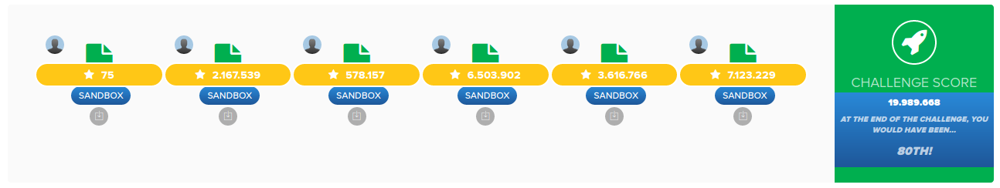

# reply2020

My solution to [Reply's 2020 Code Challenge](https://challenges.reply.com/tamtamy/challenges/category/coding) ([problem statement](https://github.com/eavilaes/ReplyChallenge2020/blob/master/ProblemStatement.pdf)).

## Score

## License
MIT